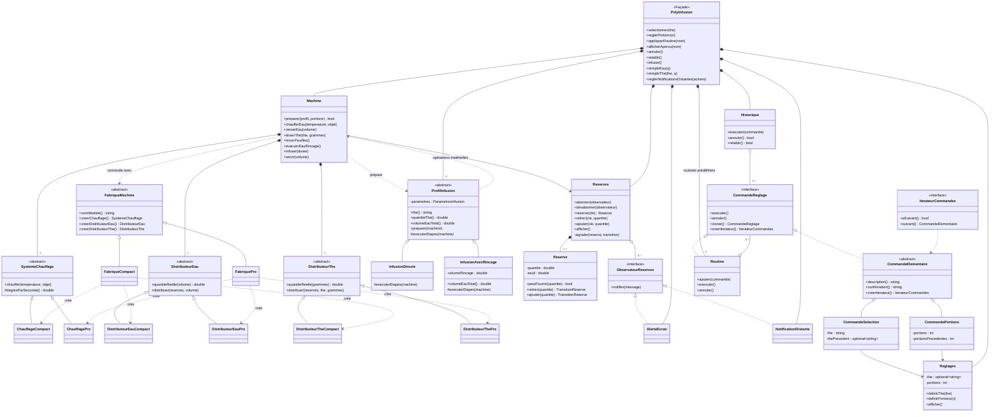

# Diagramme de classes — PolyInfusion (TP2a + TP2b)

```mermaid
classDiagram
direction TB

class PolyInfusion {
  <<Façade>>
  +selectionner(the)
  +reglerPortions(n)
  +appliquerRoutine(nom)
  +afficherApercu(nom)
  +annuler()
  +retablir()
  +infuser()
  +remplirEau(q)
  +remplirThe(the, q)
  +reglerNotificationsDistantes(actives)
}

class FabriqueMachine {
  <<abstract>>
  +nomModele() string
  +creerChauffage() SystemeChauffage
  +creerDistributeurEau() DistributeurEau
  +creerDistributeurThe() DistributeurThe
}
class FabriqueCompact
class FabriquePro
class SystemeChauffage {
  <<abstract>>
  +chauffer(temperature, objet)
  #degresParSeconde() double
}
class DistributeurEau {
  <<abstract>>
  +quantiteReelle(volume) double
  +distribuer(reserves, volume)
}
class DistributeurThe {
  <<abstract>>
  +quantiteReelle(grammes) double
  +distribuer(reserves, the, grammes)
}
class ChauffageCompact
class ChauffagePro
class DistributeurEauCompact
class DistributeurEauPro
class DistributeurTheCompact
class DistributeurThePro

class Machine {
  +preparer(profil, portions) bool
  +chaufferEau(temperature, objet)
  +verserEau(volume)
  +doserThe(the, grammes)
  +rincerFeuilles()
  +evacuerEauRincage()
  +infuser(duree)
  +servir(volume)
}

class ProfilInfusion {
  <<abstract>>
  -parametres : ParametresInfusion
  +the() string
  +quantiteThe() double
  +volumeEauTotal() double
  +preparer(machine)
  #executerEtapes(machine)*
}
class InfusionDirecte {
  #executerEtapes(machine)
}
class InfusionAvecRincage {
  -volumeRincage : double
  +volumeEauTotal() double
  #executerEtapes(machine)
}

class Reserves {
  +abonner(observateur)
  +desabonner(observateur)
  +reserve(cle) Reserve
  +retirer(cle, quantite)
  +ajouter(cle, quantite)
  +afficher()
  -signaler(reserve, transition)
}
class Reserve {
  -quantite : double
  -seuil : double
  +peutFournir(quantite) bool
  +retirer(quantite) TransitionReserve
  +ajouter(quantite) TransitionReserve
}
class ObservateurReserves {
  <<interface>>
  +notifier(message)
}
class AlerteEcran
class NotificationDistante

class Reglages {
  -the : optional~string~
  -portions : int
  +definirThe(the)
  +definirPortions(n)
  +afficher()
}
class Historique {
  +executer(commande)
  +annuler() bool
  +retablir() bool
}
class CommandeReglage {
  <<interface>>
  +executer()
  +annuler()
  +cloner() CommandeReglage
  +creerIterateur() IterateurCommandes
}
class CommandeElementaire {
  <<abstract>>
  +description() string
  +confirmation() string
  +creerIterateur() IterateurCommandes
}
class CommandeSelection {
  -the : string
  -thePrecedent : optional~string~
}
class CommandePortions {
  -portions : int
  -portionsPrecedentes : int
}
class Routine {
  +ajouter(commande)
  +executer()
  +annuler()
}
class IterateurCommandes {
  <<interface>>
  +aSuivant() bool
  +suivant() CommandeElementaire
}

FabriqueMachine <|-- FabriqueCompact
FabriqueMachine <|-- FabriquePro
SystemeChauffage <|-- ChauffageCompact
SystemeChauffage <|-- ChauffagePro
DistributeurEau <|-- DistributeurEauCompact
DistributeurEau <|-- DistributeurEauPro
DistributeurThe <|-- DistributeurTheCompact
DistributeurThe <|-- DistributeurThePro
FabriqueCompact ..> ChauffageCompact : crée
FabriqueCompact ..> DistributeurEauCompact : crée
FabriqueCompact ..> DistributeurTheCompact : crée
FabriquePro ..> ChauffagePro : crée
FabriquePro ..> DistributeurEauPro : crée
FabriquePro ..> DistributeurThePro : crée

Machine ..> FabriqueMachine : construite avec
Machine *-- "1" SystemeChauffage
Machine *-- "1" DistributeurEau
Machine *-- "1" DistributeurThe
Machine --> Reserves
Machine ..> ProfilInfusion : prépare

ProfilInfusion <|-- InfusionDirecte
ProfilInfusion <|-- InfusionAvecRincage
ProfilInfusion ..> Machine : opérations matérielles

Reserves *-- "1..*" Reserve
Reserves o-- "0..*" ObservateurReserves
ObservateurReserves <|.. AlerteEcran
ObservateurReserves <|.. NotificationDistante

CommandeReglage <|.. CommandeElementaire
CommandeReglage <|.. Routine
CommandeElementaire <|-- CommandeSelection
CommandeElementaire <|-- CommandePortions
Routine o-- "0..*" CommandeReglage
CommandeSelection --> Reglages
CommandePortions --> Reglages
Historique o-- "0..*" CommandeReglage
IterateurCommandes ..> CommandeElementaire

PolyInfusion *-- Machine
PolyInfusion *-- Reserves
PolyInfusion *-- "3" ProfilInfusion
PolyInfusion *-- Reglages
PolyInfusion *-- Historique
PolyInfusion *-- "3" Routine : routines prédéfinies
PolyInfusion *-- AlerteEcran
PolyInfusion *-- NotificationDistante
```
